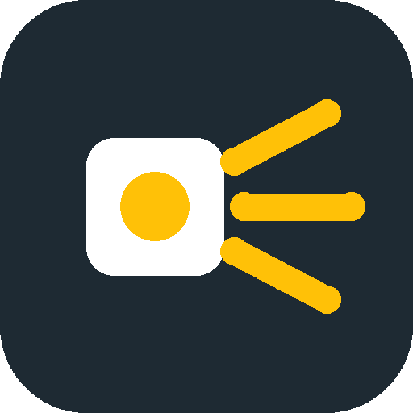
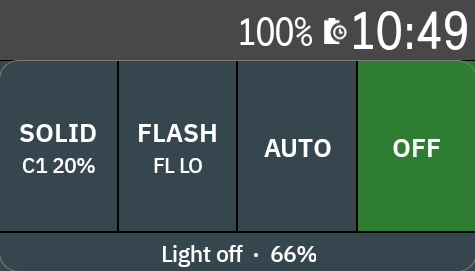
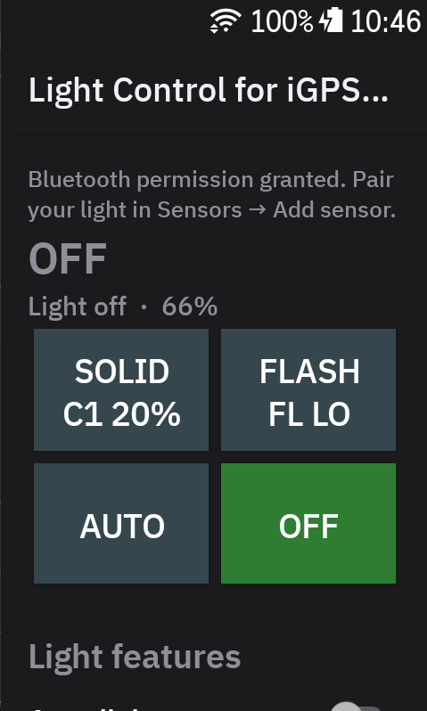
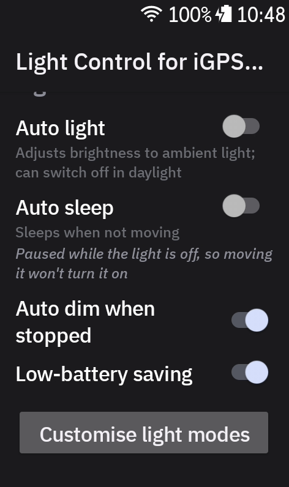
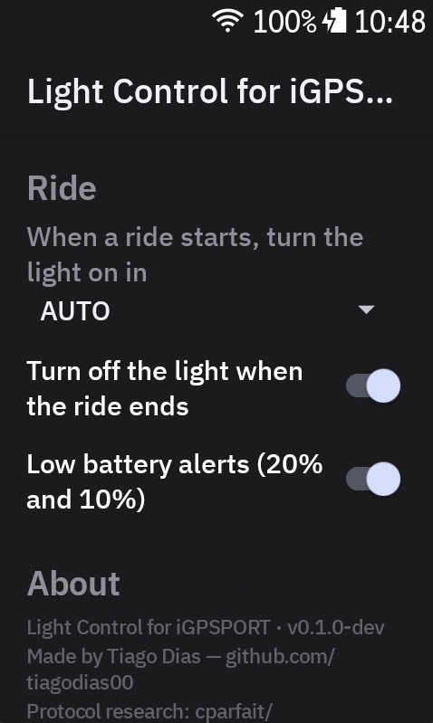

<div align="center">



# Light Control for iGPSPORT

**Control your iGPSPORT bike light from your Hammerhead Karoo.**

Switch modes with a tap on your ride screen, keep an eye on the light's battery,
and let the light switch on and off with your rides.

[](https://github.com/tiagodias00/igpsport-karoo/releases/latest)
[](https://github.com/tiagodias00/igpsport-karoo/releases)
[](https://github.com/tiagodias00/igpsport-karoo/actions/workflows/build.yml)
[](LICENSE)

[](https://github.com/tiagodias00/igpsport-karoo/releases/latest)

[Features](#what-it-does) · [Install](#install) · [Set up](#set-up) · [Good to know](#good-to-know) · [Troubleshooting](#troubleshooting) · [Changelog](CHANGELOG.md)



<sub>Free and open source · Works offline · Nothing to set up on your phone</sub>

</div>

---

## What it does

### Control the light from your ride screen

Add the **Light controls** field to any ride page. It comes in three sizes: regular, slim, and a
one-row compact version.

- **SOLID:** steady light. Tap it again to go through the levels: HIGH → MID → LOW.
- **FLASH:** flashing light. Tap it again to switch between FL HI and FL LO.
- **AUTO:** the light sets its own brightness from the daylight around it. The button shows which
  mode it's using, and **DIMMED** when the light has turned itself down.
- **OFF:** switches the light off.
- The bottom line shows the light's **battery** and roughly **how long it will last** in the
  current mode.

The button that's lit up green is the mode the light is in right now. If you change the mode with
the light's own button, the field follows.

### The app page

Open **Light Control for iGPSPORT** from the Karoo's app list. You get the same four buttons, plus
the light's own automatic features and your ride settings.

| Mode buttons | Light features | Ride settings |
|:---:|:---:|:---:|
|  |  |  |

- **Light features:** switch these on or off, and the light remembers them:
  - **Auto light:** brightness follows the daylight; the light may switch itself off in bright sun.
  - **Auto sleep:** the light sleeps when it hasn't moved for a minute.
  - **Auto dim when stopped:** turns the light down when you stop.
  - **Low-battery saving:** turns the light down when its battery gets low.
- **Ride settings:**
  - **When a ride starts, turn the light on in …:** pick a mode, AUTO, or "don't change".
  - **Turn off the light when the ride ends.**
  - **Low battery alerts** on the Karoo at 20 % and 10 %.

### Make your own light mode

On the app page, tap **Customise light modes** to change the light's custom mode:

- Choose **steady** or **flash**.
- Set the **brightness**, from 5 to 100 %.
- For flash, set how fast it flashes (**cycle**, 1–4 s) and how long it stays on in each flash
  (**lighting time**, 10–50 %).

Changes go to the light as soon as you let go of a slider. **Show on light** switches the light
to your mode so you can see it, and **Restore original** puts back how it was before. On the ride
field your mode shows up as e.g. **C1 20%** under SOLID, or **C1** under FLASH if it flashes.

### And a few more things

- **Karoo buttons:** you can set the Karoo's hardware buttons to switch the light: next mode,
  solid, flash, auto, off, or open the app page. Set them up in the Karoo's **Settings →
  Controls**.
- **Light battery** field: a plain battery number, if you'd like one on its own.
- **Reconnects by itself** after the light has been asleep. If the field says "Searching for
  light… tap to retry", tap it.

## Good to know

> [!IMPORTANT]
> **OFF from the Karoo means standby, not powered off.** Only the beam goes off. The light stays
> on standby, connected to the Karoo, so it can come back on straight away, for example by itself
> at the start of your next ride. It won't wake up and switch itself on when you move the bike.
> Standby uses very little battery: under 1 % in 2 hours in our test.

- **To power the light off completely,** hold its own button, as usual.
- **"Turn off the light when the ride ends"** also leaves it on standby. Together with "When a ride
  starts, turn the light on in …", the light switches on automatically when you start your next
  ride, and off when you finish.
- **While the Karoo has the light off, the light's Auto sleep is paused.** That is what stops it
  waking up when moved. Auto sleep comes back on when you pick a mode, or switch the light on with
  its button. If you then ride with the light but without the Karoo, Auto sleep stays off until
  the Karoo connects to it again.
- **Custom-mode changes are saved in the light itself.** They stay after the light is switched off,
  and you'll also see them in the iGPSPORT phone app.
- **The light talks to one device at a time.** If the iGPSPORT phone app is connected to it, the
  Karoo can't be.

## What you need

- A **Hammerhead Karoo 3** with a recent software update.
- An **iGPSPORT VS1200S** light. Other iGPSPORT VS and TL lights may work too, but they haven't been
  tested. If you try one, please [open an issue](https://github.com/tiagodias00/igpsport-karoo/issues)
  and say how it went.
- A phone with the **Hammerhead Companion** app, paired with your Karoo, to install the extension.

## Install

> [!TIP]
> It takes about two minutes, and you don't need a cable or a computer.

1. Make sure your Karoo is **switched on, on Wi-Fi, and paired** with the Hammerhead Companion app on
   your phone.
2. On your **phone**, open this link:
   **[github.com/tiagodias00/igpsport-karoo/releases/latest](https://github.com/tiagodias00/igpsport-karoo/releases/latest)**
3. Scroll down to **Assets**. **Press and hold** `igpsport-karoo.apk`, then tap **Share**, then
   choose **Hammerhead Companion**.
4. On the **Karoo**, confirm the install when it asks.

This is Hammerhead's normal way of installing extensions that aren't in its built-in library.

## Set up

1. **Open the app** on the Karoo: **Light Control for iGPSPORT**. When it asks, allow **Nearby
   devices**, which lets it use Bluetooth.
2. **Close the iGPSPORT app on your phone**, or switch off your phone's Bluetooth for a moment. The
   light only talks to one device at a time.
3. **Wake the light up:** switch it on and give it a little shake.
4. **Pair it:** on the Karoo, go to **Sensors → Add sensor** and pick your light (e.g. **VS1200S**).
5. **Add the field:** edit one of your ride pages, add a field, and choose **Light controls**
   (regular, slim or compact) from the Light Control for iGPSPORT list.
6. **Optional:** on the app page, choose what the light should do when a ride starts and ends.

## Updating

On the Karoo, open the extension list, **press and hold** Light Control for iGPSPORT, and tap
**Update**. Your light pairing, fields and settings are kept.

What changed in each version: see the [changelog](CHANGELOG.md).

## Troubleshooting

- **A red cross next to the light in Sensors:** the light is probably asleep. Shake it, then tap
  Retry.
- **The field says "Searching for light… tap to retry"** (the compact field shows ↻): wake the light,
  then tap the field.
- **It won't connect at all:** make sure the iGPSPORT phone app isn't connected to the light.
- **AUTO doesn't say when the light switched itself off in the sun:** the light doesn't report
  that, so the Karoo can't show it.
- **Where's "speed-based brightness" or "turn off with bike computer"?** Those light features only
  work with iGPSPORT's own bike computers, so they're left out here. Use "Turn off the light when
  the ride ends" instead.

## Privacy

The extension doesn't use the internet and collects no data. It only talks to your light over
Bluetooth.

## For developers

<details>
<summary>Install over USB, build from source</summary>

**Install with adb:** on the Karoo, enable Developer options (Settings → About → tap Build Number
7 times) and USB debugging, then run:

```
adb install -r igpsport-karoo.apk
```

**Build:** needs JDK 17 and Android SDK 35.

```
./gradlew test :app:assembleDebug
```

`tools/probe` has a small Python/BLE tool used to work out the light's protocol from a PC; see
`probe.py` for usage. Extension compatibility: karoo-ext 1.1.9, Karoo OS 1.634.2440 or newer.

</details>

## Credits

- Made by Tiago Dias ([github.com/tiagodias00](https://github.com/tiagodias00)).
- The light's Bluetooth protocol was learned from
  [cparfait/Bike-Light-Control](https://github.com/cparfait/Bike-Light-Control) (MIT). This extension
  is an independent Kotlin reimplementation; no code was copied from it.
- Built with [karoo-ext](https://github.com/hammerheadnav/karoo-ext) by Hammerhead.

## Disclaimer

Not affiliated with or endorsed by iGPSPORT or Hammerhead. Use at your own risk.

## License

MIT, see [LICENSE](LICENSE).
